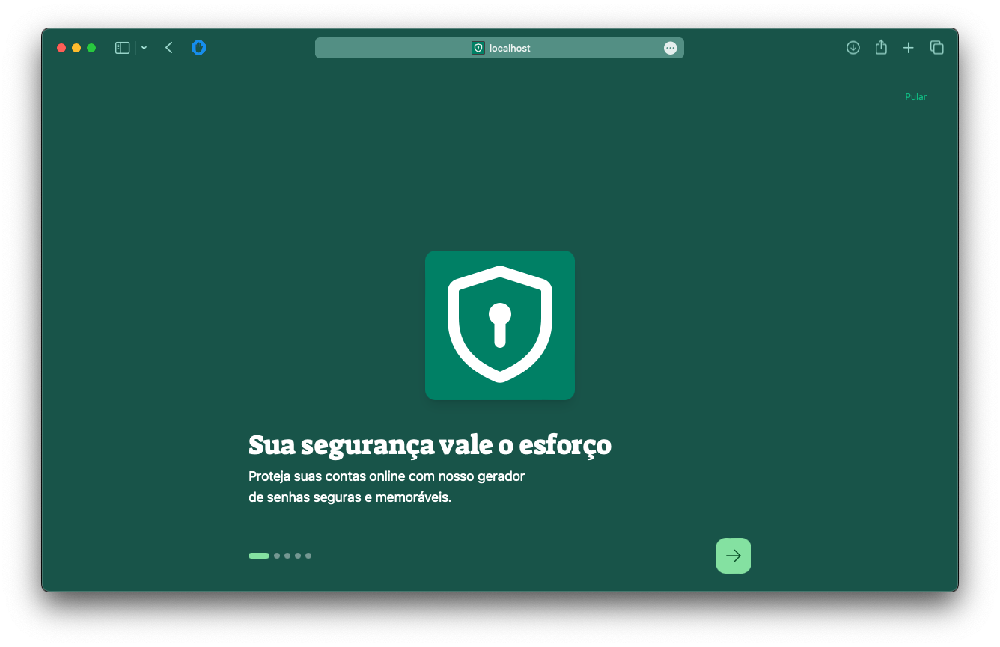

# EasyGuard: Gerador de senhas seguras e memoráveis

<p align="center"></p>

Este repositório está vinculado ao artigo "EasyGuard: Um gerador de senhas seguras e memoráveis", de Hugo Lima Romão, Marcelo Henrique Oliveira Henklain, Felipe Leite Lobo e Eduardo Luzeiro Feitosa.

Resumo do Artigo: _"Embora o uso de serviços on-line tenha aumentado substancialmente na última década, a força das senhas criadas pelos usuários não mudou muito. O objetivo deste estudo foi desenvolver e avaliar a eficiência de app gamificado em relação ao desenvolvimento do comportamento de ?projetar senhas fortes?. Avaliamos a sua eficiência em um estudo com cinco participantes, durante nove dias. Em comparação com o algoritmo de geração de senhas convencional, verificamos que as senhas geradas por nosso app desempenharam 40,89% melhor em teste de memorização, 12,19% melhor em teste de digitação e 15,63% melhor em teste combinado. Nossa abordagem se mostrou promissora no ensino de técnicas que combinam senhas fortes e mais memoráveis."_

## Resumo

O gerador de senhas EasyGuard oferece uma estratégia para a criação de senhas fortes e memoráveis a partir de entradas significativas do usuário. Nosso objetivo principal com essa aplicação é o desenvolvimento do comportamento de “Projetar senhas fortes”. Sabendo que esse é um comportamento custoso para o usuário, utilizamos elementos presentes em jogos para reforçar os comportamentos de interagir com a aplicação e projetar senhas fortes. Nesse repositório, apresentamos os links de acesso e instalação e os procedimentos para execução do projeto em máquina local.

## Acesso público ao EasyGuard

O projeto proposto é disponibilizado de duas formas. A primeira, na Internet, como uma aplicação web, a partir do endereço <https://easyguard.vercel.app>. A segunda forma é por meio da instalação de um aplicativo Android, disponível no endereço <https://play.google.com/store/apps/details?id=app.hugoromao.gamified_password_generator.twa>.

## Executando o projeto localmente

O código desenvolvido consiste em um sistema web. Em adição, disponibilizamos a ferramenta como app Android a partir da loja Google Play Store, que permite que [Progressive Web Apps](https://developer.mozilla.org/en-US/docs/Web/Progressive_web_apps) (PWAs) sejam publicadas a partir da funcionalidade [Trusted Web Activity](https://developer.chrome.com/docs/android/trusted-web-activity). Dessa forma, as etapas a seguir abordam apenas a instalação e execução do servidor web em máquina local.

### Ambiente de execução

- Sistema Operacional: Ubuntu 20.04
- Navegadores: Google Chrome

### Dependências

- Node.js 18.20.3 ou mais recente.
- Npm 10.7.0 ou mais recente.
- Git 2.4.3 ou mais recente.

Clone e acesse a pasta do projeto em sua máquina:

```
git clone https://github.com/hugoromao/easyguard
cd easyguard
```

Instale as dependências do projeto:

```
npm install
```

Inicie o servidor web em versão de desenvolvimento:

```
npm run dev
```

Você pode acessar a aplicação a partir do endereço http://localhost:3000. Por padrão a aplicação utiliza a porta 3000. A instalação foi bem sucedida caso a seguinte tela apareça em seu navegador.



A Google Play Store permite que PWAs sejam publicadas como aplicativos Android. Para publicar este projeto como um aplicativo Android, utilize o seguinte link: <https://developers.google.com/codelabs/pwa-in-play>.

## Exemplo de uso

A página inicial é o seu ponto de partida sempre que você precisar criar uma senha. Os botões destacados de vermelho na imagem abaixo iniciam o fluxo de criação de senha.


Nosso método de criação de senhas se baseia em palavras significativas para você. Você deve escolher, no mínimo, **quatro palavras** e **dois números**, quanto mais desconexos melhor, desde que seja algo que você se lembre facilmente. Evite qualquer coisa muito óbvia sobre você, como nome ou data de nascimento. As marcações em vermelho abaixo mostram as locais onde você deve inserir as palavras e os números.

Se quiser, você pode aumentar a força da senha adicionando mais palavras, o que é ideal para contas mais importantes, como contas bancárias ou de trabalho.

|  |  |

Depois de escolhes as palavras, você será redirecionado para a página onde sua senha estará disponível para uso. Destacamos as seções mais importantes da página na imagem a seguir.


1. **Senha:** Sua senha é apresentada no topo da página. Você pode, se quiser, fazer pequenas alterações na senha clicando na área onde a senha é apresentada.
2. **Regerar:** O botão **Regerar** serve para gerar uma nova senha aleatória a partir das palavras e números já fornecidos.
3. **Copiar senha:** Para utilizar sua senha basta clicar no botão **Copiar senha**. Sua senha será copiada para área de transferência, e você poderá colar onde quiser.
4. **Feedback:** Nessa seção, apresentamos um breve feedback sobre a força da sua senha, juntamente com o nível de entropia da sua senha. Quanto maior o número de entropia, mais segura é sua senha, use isso a seu favor!
5. **Abrir Bitwarden:** Recomendamos que as senhas geradas por nossa aplicação sejam armazenadas em um gerenciador de senhas. O botão **Abrir Bitwarden** é um atalho para um famoso e consolidado gerenciador de senhas.
