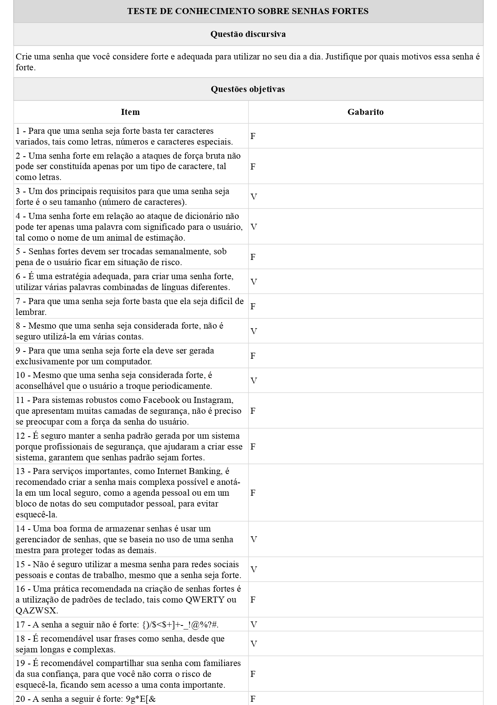
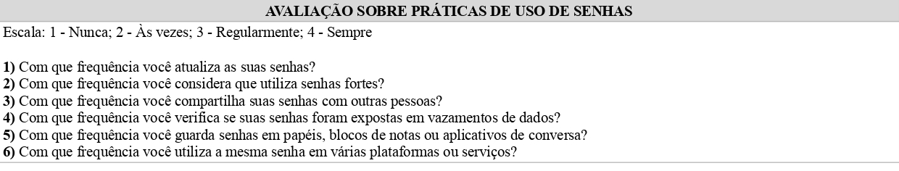
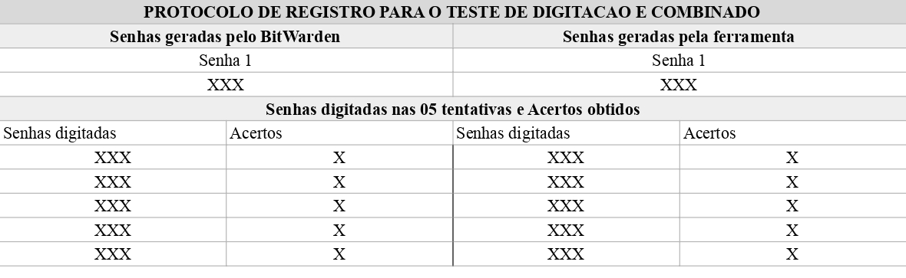
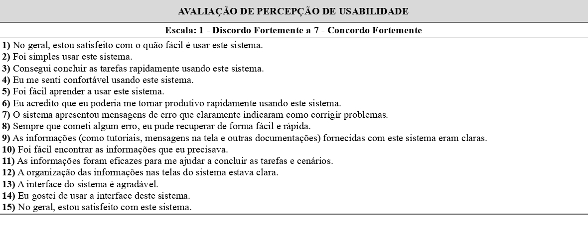

# EasyGuard: Gerador de senhas seguras e memoráveis

<p align="center"></p>

Este repositório está vinculado ao artigo "Construção e Teste de App Gamificado Gerador de Senhas Fortes e Memoráveis: Um Estudo Exploratório", de Hugo Lima Romão, Marcelo Henrique Oliveira Henklain, Felipe Leite Lobo e Eduardo Luzeiro Feitosa.

Resumo do Artigo: _"Embora o uso de serviços on-line tenha aumentado substancialmente na última década, a força das senhas criadas pelos usuários não mudou muito. O objetivo deste estudo foi desenvolver e avaliar a eficiência de app gamificado em relação ao desenvolvimento do comportamento de “projetar senhas fortes”. Avaliamos a sua eficiência em um estudo com cinco participantes, durante nove dias. Em comparação com o algoritmo de geração de senhas convencional, verificamos que as senhas geradas por nosso app desempenharam 40,89% melhor em teste de memorização, 12,19% melhor em teste de digitação e 15,63% melhor em teste combinado. Nossa abordagem se mostrou promissora no ensino de técnicas que combinam senhas fortes e mais memoráveis."_

## Resumo

O gerador de senhas EasyGuard oferece uma estratégia para a criação de senhas fortes e memoráveis a partir de entradas significativas do usuário. Nosso objetivo principal com essa aplicação é o desenvolvimento do comportamento de “Projetar senhas fortes”. Em adição, utilizamos elementos presentes em jogos para reforçar os comportamentos de interagir com a aplicação e projetar senhas fortes. Nesse repositório, apresentamos os links de acesso e instalação, os procedimentos para execução do projeto em máquina local, bem como exemplos dos protocolos utilizados nos experimentos descritos no artigo.

## Acesso público ao EasyGuard

O projeto proposto é disponibilizado de duas formas. A primeira, na Internet, como uma aplicação web, a partir do endereço <https://easyguard.vercel.app>. A segunda forma é por meio da instalação de um aplicativo Android, disponível no endereço <https://play.google.com/store/apps/details?id=app.hugoromao.gamified_password_generator.twa>.

## Executando o projeto localmente

As etapas a seguir abordam a instalação e execução do servidor web em máquina local.

### Ambiente de execução

- Sistema Operacional: Ubuntu 20.04
- Navegadores: Google Chrome

### Dependências

- Node.js 18.20.3 ou mais recente.
- Npm 10.7.0 ou mais recente.
- Git 2.4.3 ou mais recente.

Clone e acesse a pasta do projeto em sua máquina:

```
git clone https://github.com/hugoromao/easyguard
cd easyguard
```

Instale as dependências do projeto:

```
npm install
```

Inicie o servidor web em versão de desenvolvimento:

```
npm run dev
```

Você pode acessar a aplicação a partir do endereço http://localhost:3000. Por padrão a aplicação utiliza a porta 3000. A instalação foi bem sucedida caso a seguinte tela apareça em seu navegador.


A Google Play Store permite que Progressive Web Apps (PWA) sejam publicadas como aplicativos Android. Para publicar este projeto como um aplicativo Android, utilize o seguinte link: <https://developers.google.com/codelabs/pwa-in-play>.

## Protocolos utilizados e execução do experimento

Os experimentos desenvolvidos no artigo consistem em um estudo com duração de nove dias a fim de avaliar os aspectos de eficiência do EasyGuard. Nesta seção, apresentamos o procedimento para coleta dos dados, juntamente com os protocolos necessários para a reprodução do experimento. A figura a seguir ilustra o cronograma utilizado no estudo.

| DIA 1 (Em laboratório)                                            | DIA 2 - DIA 8          | DIA 9                                                              |
| ----------------------------------------------------------------- | ---------------------- | ------------------------------------------------------------------ |
| Assinatura do Termo de Consentimento Libre e Esclarecido          | Período de uso do app  | Aplicação de teste de conhecimento sobre senhas fortes(Pós-teste)  |
| Aplicação de teste de conhecimento sobre senhas fortes(Pré-teste) | Registro de uso do app | Aplicação de questionário sobre percepção de usabilidade(Opcional) |
| Aplicação de questionário sobre práticas de uso de senhas         |                        |                                                                    |
| Aplicação dos testes de memória, digitação e teste combinado      |                        |                                                                    |
| Aplicação de questionário sobre percepção de usabilidade          |                        |                                                                    |

Os questionários e protocolos aplicados em laboratório foram

### Teste de conhecimento sobre senhas fortes



### Questionário sobre práticas de uso de senhas



### Teste de memória, digitação e combinado



### Questionário de percepção de usabilidade


